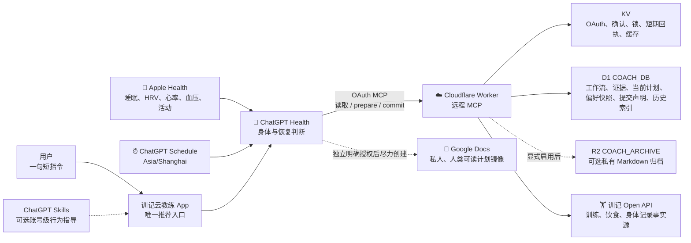

# 🏋️ Xunji Training Planner & Cloud Coach（训记训练规划师 / 训记云教练）

> ☁️ 完全云端运行 · 🍎 Apple Health 恢复判断 · 🤖 ChatGPT 动态规划 · ✅ 确认后写入训记

这是一个把 **ChatGPT Health、Apple Health、训记与 Cloudflare** 连接起来的开源个人训练教练。当前仓库版本为 `1.5.1`，对用户只暴露一个自定义 App **“训记云教练”**，由它在云端选择三个工作流：

- `training_planner`：首次或阶段性制定 1–2 个月训练总纲。
- `weekly_adjustment`：在已确认总纲内微调下一周。
- `daily_adjustment`：根据当天恢复状态给出训练决策。

仓库中的 `xunji-training-planner` 与 `xunji-cloud-coach` 是可选的 ChatGPT 账号级指导 Skill，不是连接器，也不是必经入口。实际运行能力来自“训记云教练”App 后面的 MCP、Worker 与 D1。

部署后的云端运行不依赖常开电脑、公网 IP、家庭服务器或本地远程连接器。

> [!IMPORTANT]
> 这是非官方社区项目，与训记、Apple、OpenAI 或 Cloudflare 无隶属关系。项目只辅助训练与恢复决策，不提供医疗诊断。训练总纲和训练写入都必须先展示摘要并等待用户明确确认。

## ✨ 项目功能

- 🧭 **制定 1–2 个月训练总纲**：由训记训练规划师综合用户目标、训练经验、器械、时间、伤病禁忌、偏好与近期身体状态，生成阶段性方向。
- 📅 **每周生成一周计划**：训记云教练复盘最近训练、饮食和恢复情况，在总纲范围内微调下一周，并在用户确认后写入训记。
- 🚦 **每天生成训练决策卡**：训练前结合睡眠、HRV、静息心率、血压、活动量和漏训情况，给出正常训练、降量训练或恢复休息建议。
- 🍽️ **监督饮食趋势**：读取训记饮食记录，只在趋势确实影响减脂或恢复时给出简短提醒。
- 🏋️ **复用训记官方内容**：读取训记官方计划、搜索标准动作名称，并尽量选择训记中已有说明或动画的动作。
- 🔐 **确认优先与幂等保护**：所有写入先 `prepare`，用户确认后才 `commit`；D1 唯一提交声明阻止同一确认令牌并发写入训记，KV 保存短期确认、状态和回执。
- ☁️ **账号指令与云端内容分离**：可选 ChatGPT Skills 保存在用户的 ChatGPT 账号中；仓库 `skills/` 只是安装、更新和版本管理来源。运行时工作流、医学证据和偏好模板从 D1 读取，代码不读取仓库本地文件。
- 📄 **可选私人计划镜像**：整体计划确认后，可在用户单独授权相应派生健康摘要写入 Google Docs 的前提下创建私人、人类可读镜像；未授权或创建失败不会阻断总纲、首周计划或 Schedule。

## 最简启动方式

不要从普通对话或 Skill 直接开始。打开 ChatGPT 中的 **“训记云教练”App → Try in chat**，然后只需说：

- `帮我制定新的整体训练计划`
- `帮我调整下周训练`
- `我今天怎么练`

App 会根据意图选择对应工作流，并把 `xunji_workflow_context_get` 作为首个工具调用。只有成功读到云端 `workflow_version`、`evidence_version` 且 `local_files_used: false` 后，才会读取数据或生成计划。若当前会话不支持 Developer MCP、工具不可见或连接失败，应立即停止，不先写一份无法保存的计划；从 App 的 **Try in chat** 新建会话即可，不需要粘贴长提示词。

## ✅ 前置条件

- **支持 Health 功能的 ChatGPT 订阅账号**：需要能够在 ChatGPT 中连接 Apple Health，同时具备远程自定义 MCP 所需的读取和写入能力。Apple Health 连接需要 iPhone；套餐、地区和工作区权限以 [OpenAI Health](https://help.openai.com/en/articles/20001036-health-in-chatgpt) 与 [MCP 开发者模式](https://help.openai.com/en/articles/12584461-developer-mode-apps-and-full-mcp-connectors-in-chatgpt-beta) 的最新说明为准。
- **训记账号和相应 Open API 权限**：需要从训记 App 获取训练、饮食和身体数据 Open API Key。本项目依赖训记持续维护这些能力，建议付费支持训记及其开发者。
- **Cloudflare 云端账号**：用于运行 Worker、KV 和 D1。R2 仅在用户明确接受相应订阅与计费条件后作为可选归档层启用；如果界面要求升级套餐、添加付费功能或绑定信用卡，应停止操作并让用户决定。
- **可选 Google Drive/Docs 连接**：仅在需要私人、人类可读计划镜像时连接。未连接或不授权派生健康摘要写入，不影响 D1 中的训练总纲、首周计划、每周/每日调整或 Scheduled Tasks。

iPhone 需要定期联网，把 Apple Health 数据同步给 ChatGPT。ChatGPT Health 当前只读取 Apple Health，不会把数据写回 Apple Health。

## 🧠 数据边界

- **Apple Health 原始数据**只存在于 iPhone 与 ChatGPT Health 链路中，不进入 Worker、D1、R2 或 Google Drive。
- **经用户确认的派生摘要**可能进入 D1，并在用户对 Google Docs 存储目的地和具体类别另行明确授权后进入私人文档，例如伤病/安全限制、睡眠/HRV/静息心率趋势、体重体脂趋势、训练偏好和医学证据摘要；这些都不是 Health 原始时间序列。
- **训记**是实际训练、饮食和身体记录的事实源；Worker 只通过用户授权的 Open API 读取或确认后写入。
- **KV**只保存 OAuth 状态、确认令牌、提交锁、短期回执和必要缓存，不保存长期计划正文。
- **D1 `COACH_DB`**保存已激活的工作流内容、证据版本、当前训练总纲、偏好约束快照、Google Docs 镜像状态/链接、强一致提交声明、历史索引和训练决策日志；临时提交声明保留 7 天后清理。
- **R2 `COACH_ARCHIVE`（可选）**在用户明确启用后私有保存训练总纲与训练调整 Markdown 归档；未配置时 D1 仍保存完整结构化计划、决策日志和历史索引，归档状态返回 `not_configured`。
- **Google Docs**在总纲确认保存后由 ChatGPT 尽力创建为私人、人类可读镜像，但总纲保存确认不自动授权向 Google Docs 披露派生健康摘要。新计划的镜像状态从 `pending` 开始：明确授权且创建/回读成功后记为 `stored`；未授权、未连接或创建失败时可记为 `failed` 并只保存稳定错误码。`stored` 记录不可覆盖或降级。Google Docs 不是运行时事实源，不能成为 Scheduled Tasks 的硬依赖，周/日调整也不会自动改写它。

## 工作流约束

“训记云教练”App 必须根据用户意图选择工作流，并先调用 `xunji_workflow_context_get` 读取云端工作流上下文、当前证据版本、当前计划和近期历史索引。云端运行时不得读取仓库里的本地文件。账号 Skills 即使已安装，也只能补充行为约束，不能替代 App 或让不支持 Developer MCP 的普通会话获得工具能力。

训练总纲流程：

1. `xunji_workflow_context_get`，`workflow: "training_planner"`；
2. 与用户确认目标、经验、器械、时间、伤病禁忌和偏好；
3. `xunji_prepare_coaching_plan_upsert` 预览总纲，并展示 `post_commit.google_docs_mirror` 披露说明：私人 Google Docs 目的地、拟写入的派生健康摘要类别、不含 Health 原始时间序列，以及镜像失败不阻断后续流程；
4. 分别询问“是否保存总纲”和“是否允许把所列派生摘要写入私人 Google Docs”。两项可以在用户同一次回复中分别确认，但只确认总纲不等于授权镜像；
5. 用户明确确认总纲后调用 `xunji_commit_coaching_plan_upsert`，无论是否授权镜像都不影响总纲保存；
6. 只有取得 Google Docs 明确授权后，才使用已连接的 Google Drive/Docs 创建该计划版本的私人文档，回读验证后调用 `xunji_commit_coaching_plan_mirror` 记录 `stored` 链接。未明确授权时不向 Drive 发送内容，可记录 `failed / google_docs_not_authorized`；未连接或创建失败时记录其他不含敏感正文的稳定错误码。任何镜像结果都不回滚总纲，也不阻断后续流程；
7. 新阶段首次保存成功后，立即加载 `weekly_adjustment`，在同一会话生成从 `start_date` 开始的第一周草案并核对训记标准动作名；不等待周日 Schedule，也不要求用户重复发起请求；
8. 总纲保存确认与第一周训练写入确认相互独立；第一周只能在逐日预览展示后，经用户新的明确确认再 commit。

每周/每日训练调整流程：

1. `xunji_workflow_context_get`，`workflow: "weekly_adjustment"` 或 `"daily_adjustment"`；
2. 必要时用 `xunji_coaching_history_query` 查询历史索引；
3. 读取训记训练/饮食记录和 ChatGPT Health 中的最小必要 Apple Health 指标；
4. 周/日流程如需写入训练，调用 `xunji_prepare_training_upsert`，并带上包含当前 `plan_version` 和 `evidence_version` 的 `decision_context`；
5. 用户明确确认后调用 `xunji_commit_training_upsert`。

## 仓库结构

- `src/worker.mjs`：Cloudflare Worker 远程 MCP Server。
- `src/cloud-state.mjs`：D1/R2 云端状态、计划和决策归档逻辑。
- `migrations/`：D1 `COACH_DB` schema。
- `content/`：发布到 D1 的工作流与证据内容包来源。
- `skills/`：可选 ChatGPT 账号 Skills 的可审阅源文件和版本备份；安装后由 ChatGPT 账号托管，不是启动入口或 Worker 的运行时读取源。
- `docs/chatgpt-schedules.md`：首次总纲、每日决策和每周计划提示词。
- `docs/deployment.md`：Cloudflare 部署顺序。
- `test/worker.test.mjs`：OAuth、MCP、prepare/commit、D1 以及可选 R2 状态测试。

## 📚 科学参考

提示词要求 ChatGPT 展示“证据原则 → 用户数据 → 本次安排”的对应关系。当前证据包通过 `content/` 发布到 D1，云端运行只读取 `xunji_workflow_context_get` 返回的已激活证据版本，不读取本地 Markdown。

这些资料用于一般训练决策，不能代替医生、物理治疗师或其他专业人员的个体化意见。

## 🛡️ 隐私与安全边界

- 不得把训记 Key、Cloudflare Secret、OAuth token、真实健康记录或未脱敏截图提交到 GitHub。
- 正式凭据只能保存为 Cloudflare Secrets；本地 `wrangler.jsonc` 已被 Git 忽略。
- 总纲和训练安排都必须经过“展示完整摘要 → 用户明确确认 → commit”流程。
- Worker 面向单用户自托管，不应直接作为未经安全加固的多租户 SaaS。
- D1 唯一声明可以阻止同一确认令牌的并发写入；但 D1 与训记是两个系统，网络中断后的结果仍需通过训记记录人工对账。
- 完整风险说明和上线检查见 [`docs/security-review.md`](docs/security-review.md) 与 [`SECURITY.md`](SECURITY.md)。

## 📄 开源协议

本项目采用 [Apache License 2.0](LICENSE)。你可以在协议条件下使用、修改和分发代码；项目名称和说明不代表训记、Apple、OpenAI 或 Cloudflare 对本项目的官方认可。

---

# 🤖 部署 Agent 执行协议

如果用户把这个 README 或仓库地址交给你，并要求“帮我部署训记云教练”，请把下面内容视为执行协议。目标是交付一个与本项目当前形态一致的云端版本，而不是只给用户一份命令清单。

## 完成标准

只有同时满足以下条件才可以报告部署完成：

- Cloudflare Worker、独立 `OAUTH_KV` 和 D1 `COACH_DB` 已创建并成功绑定；如用户明确选择启用 R2，`COACH_ARCHIVE` 也已创建并验证，否则明确记录归档状态为 `not_configured`；
- D1 migrations 已应用，`npm run content:publish` 已把工作流与证据内容发布到远程 D1；
- `/health` 返回 `ok: true`、服务名和版本 `1.5.1`，`/mcp` 可被 ChatGPT 访问；
- 训记凭据只存在于 Cloudflare Secrets，没有出现在聊天、命令参数、日志或 Git 文件中；
- ChatGPT 已通过 OAuth 连接远程 MCP，并能实际调用只读工具；
- “训记云教练”App 可通过 **Try in chat** 打开支持 Developer MCP 的新会话；如选择安装账号 Skills，`xunji-training-planner` 与 `xunji-cloud-coach` 必须明确自己只是可选指导层，并在 MCP 不可用时先失败、不生成计划；
- 用户已在 iPhone ChatGPT 中连接 Apple Health，或 Agent 已明确记录这项唯一需要用户在手机完成的步骤；
- `Asia/Shanghai` 时区的每日决策与每周微调任务已经创建或更新；
- 已完成端到端只读验证，没有为了测试擅自创建训练、修改训记数据或购买任何服务。

## 不可突破的约束

- 可以使用用户已经拥有的 ChatGPT 与训记订阅，但不得代表用户新增购买、升级或试用任何付费服务，也不得绑定信用卡。
- 不要在输出、截图、环境变量列表、Shell history、Issue 或提交中暴露任何 Key、密码、OAuth token、KV/D1/R2 ID 或个人健康数据。
- 不要把 Apple Health 原始数据复制到 Worker、D1、R2、Google Drive 或训记，也不要尝试写回 Apple Health。
- 不要绕过 ChatGPT、Worker 或训记的用户确认机制。`prepare` 只能生成预览；只有用户看过摘要并明确确认后才能 `commit`。
- 不要把 Google Docs 当成 Scheduled Tasks 的必需依赖；它只能是总纲确认后的尽力、人类可读镜像，D1 仍是机器运行的规范来源。
- 不要把“确认保存总纲”推断为“授权向 Google Docs 披露派生健康摘要”。必须先说明目的地、私人权限和具体摘要类别；两项授权可以在同一次回复中分别表达，镜像未授权时仍继续首周交接。
- 不要猜测已经登录、授权、发布内容或部署成功。每个结论都要用页面状态、API 响应或端到端调用验证。

## 执行流程

### 1. 建立安全上下文

检查仓库状态、`.gitignore`、当前版本和现有部署配置。运行 `npm test`、`npm run check` 和内容包校验。扫描 Git 跟踪文件，确认不存在疑似训记 Key、Bearer token、Cloudflare Secret、真实 KV/D1/R2 ID 或健康数据。

只向用户请求不可自行取得的信息：必要的登录、最新训记 Open API Key，以及 iPhone 上的 Apple Health 授权。用户提供 Key 后，直接通过受保护的 Cloudflare Secret 输入流程保存；不要复述 Key，也不要先写入临时 JSON、源码或普通配置文件。

### 2. 准备 Cloudflare 资源

优先使用用户已经登录的 Cloudflare Free 账户。按照 [`wrangler.example.jsonc`](wrangler.example.jsonc) 创建本地未跟踪配置，并创建：

- KV namespace：`OAUTH_KV`
- D1 database：`COACH_DB`
- 可选 R2 bucket：`COACH_ARCHIVE`（仅在用户明确接受 R2 订阅与计费条件后创建）

设置以下 Secrets：

- `CONNECTOR_PASSWORD`
- `XUNJI_TRAIN_API_KEY`
- `XUNJI_FOOD_API_KEY`
- `XUNJI_BODY_API_KEY`

`CONNECTOR_PASSWORD` 必须是独立的、至少 32 字符的高强度随机值，并交由用户安全保存。部署前确认所有 Secret 均非空，但不要读取或显示 Secret 的值。

### 3. 迁移、发布内容并部署

部署顺序必须是：

1. 应用 D1 migrations；
2. 执行 `npm run content:publish` 发布工作流、个人偏好模板和证据内容；
3. 执行 Worker deploy。

部署后依次验证：

1. `/health` 返回 `ok: true`、服务名和版本 `1.5.1`；
2. `/mcp` 能建立远程 MCP 连接；
3. `xunji_workflow_context_get` 可读取 `training_planner`、`weekly_adjustment`、`daily_adjustment`、个人偏好模板和当前证据；
4. Worker、KV 和 D1 保持在预期计划内；R2 如未获明确同意则保持未启用，未启用任何未经用户同意的付费附加项。

详细命令见 [`docs/deployment.md`](docs/deployment.md)。

### 4. 连接 ChatGPT

在 ChatGPT Web 中确认当前账号同时具备 Health 和远程自定义 MCP 所需能力。开启允许创建自定义 MCP 的设置，把 `https://<worker-domain>/mcp` 作为 OAuth 远程服务添加，使用 `CONNECTOR_PASSWORD` 完成授权，并请求最小必要权限：`xunji.read`、`xunji.write` 和需要定时任务时的 `offline_access`。

Google Drive/Docs 是可选连接。只有用户需要私人计划镜像时才连接；连接本身不等于授权把伤病限制、恢复指标趋势、体重体脂趋势等派生摘要写入某份文档，规划流程仍需在保存摘要旁单独披露并取得明确选择。

先刷新或连接“训记云教练”自定义 MCP App，把它作为唯一推荐入口。账号 Skills 是可选增强：需要时再从仓库 `skills/` 安装或更新，不能把 Skill 会话是否可用当作 MCP 连接测试。如果 Worker 工具 schema 更新后 ChatGPT 仍显示旧工具，产品不支持刷新时可删除旧应用定义并重新创建，但不要删除 Cloudflare Worker、KV、D1 或可选 R2 数据。

连接后从 App 的 **Try in chat** 新建会话，并至少执行以下只读验证：

- 调用 `xunji_workflow_context_get` 读取 `training_planner`；
- 查询一个明确日期范围内的训练记录；
- 列出训记官方训练计划；
- 使用 `xunji_movement_search` 搜索一个标准动作，并确认返回 `movement_catalog_search_v2`；
- 调用 `xunji_coaching_history_query`，允许历史为空，但工具必须正常响应。

不得用真实写入作为连接测试。

### 5. 完成 Apple Health 授权

Apple Health 必须由用户在 iPhone 上操作。引导用户在最新版 ChatGPT iOS App 的 Health 页面连接 Apple Health，只授权训练决策实际需要的类别，例如睡眠、静息心率、HRV、体重、血压、活动和锻炼。

用户完成后，在 ChatGPT 对话中用 `@Health` 做一次最小只读查询，确认 ChatGPT 能看到近期数据。不要要求用户上传完整健康导出文件，也不要把 Health 原始数据写入训记、Worker、D1、R2 或 Google Drive。

### 6. 配置云端工作流

读取 [`docs/chatgpt-schedules.md`](docs/chatgpt-schedules.md)，不要自行简化其中的确认边界和证据规则：

- 首次训练总纲归属于训记训练规划师，不是定时任务；用户确认保存后立即交接到 `weekly_adjustment` 生成第一周草案，但写入训练仍需新的确认。
- 在可调用“训记云教练”App 的上下文中创建或更新“今日训练决策卡”：每天 `12:00`，时区 `Asia/Shanghai`。
- 在可调用“训记云教练”App 的上下文中创建或更新“下周训练计划微调”：每周日 `20:00`，时区 `Asia/Shanghai`。
- 每周只写入下一周，不一次写入整个月；调整必须先读取云端 workflow context 和已确认总纲。
- 饮食默认保持静默，只有持续趋势确实影响减脂或恢复时才给出简短提醒。

创建后重新打开两个任务，核对任务名称、频率、时区、完整 prompt 和已连接应用。不要只依据“保存成功”的短提示判断配置正确。

### 7. 端到端验收与交付

手动运行一次每日任务或等价的只读提示，证明 ChatGPT 能同时读取获准的 Health 数据和训记数据，并生成不写入的训练决策。再运行一次每周计划的只读/预览路径，证明它会先读取云端 workflow context、再读取总纲、训练与饮食，最后生成一周草案。

除非用户此时明确要求并确认某份具体计划，否则验收停在 `prepare` 之前或预览结果处，不调用任何 `commit` 工具。

最终向用户报告：

- Worker 健康检查版本和 MCP 地址；
- `xunji_workflow_context_get`、训记只读工具和历史查询的实际结果；
- 两个 Schedule 的名称、时间和时区；
- Apple Health 是否完成授权；
- 测试与安全扫描结果；
- Google Drive/Docs 如已启用，报告镜像的 `pending`、`stored` 或 `failed` 状态，并在 `stored` 时核验文档仍为私人权限；
- 仍需用户处理的真实阻塞项。

不要声称“部署完成”，除非以上证据均已取得；也不要把电脑关机后仍需本地运行的方案描述成完全云端。
